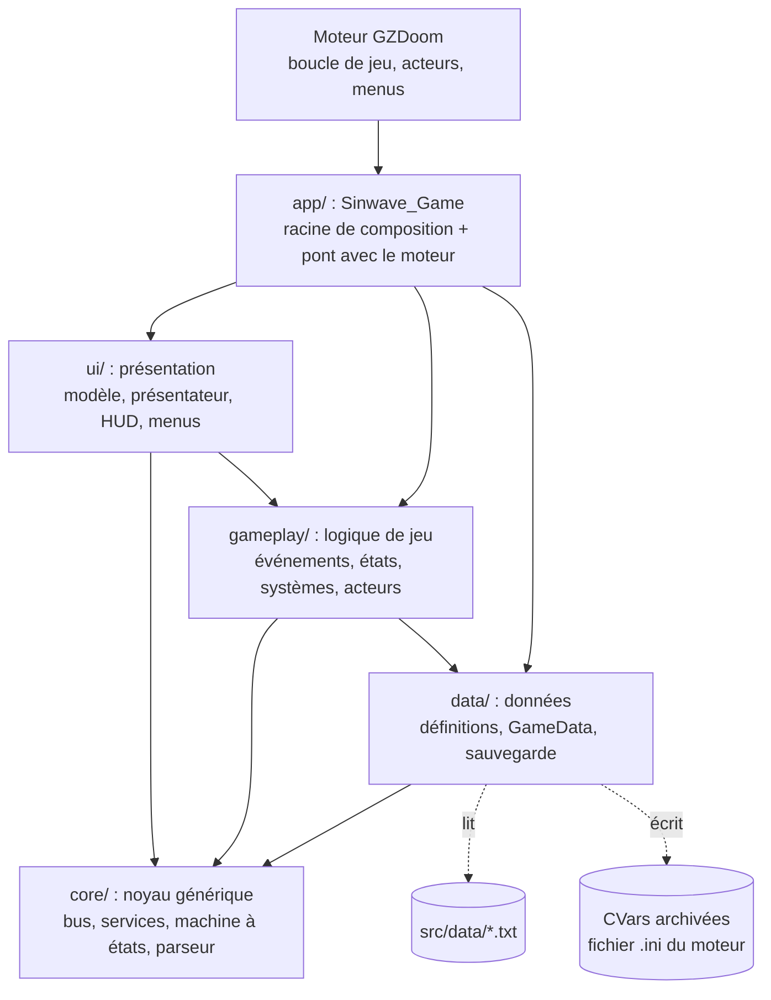
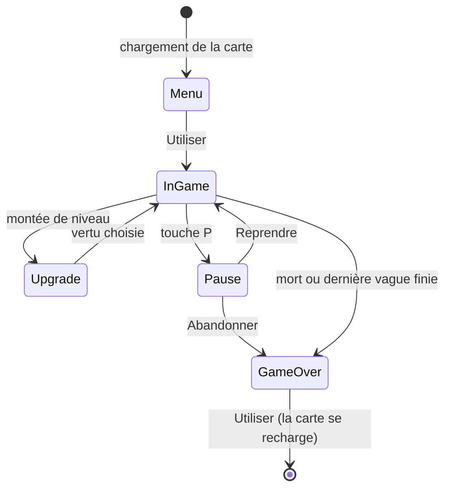
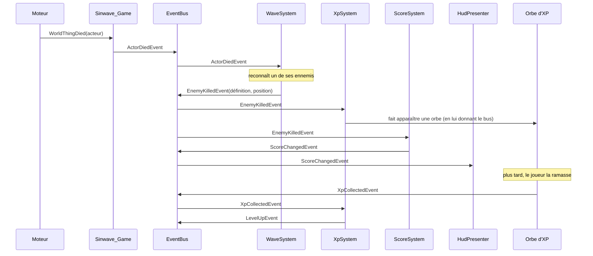
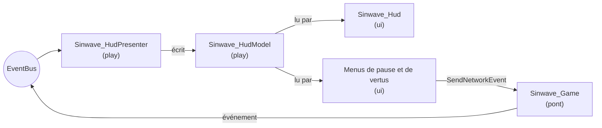

# Sinwave : architecture du prototype

Sinwave est le prototype du **projet Aegis** : un survivors-like à vagues sur le thème des sept péchés capitaux, écrit en **ZScript** pour le moteur **GZDoom 4.14.2**. Le choix du moteur est justifié dans un document séparé ; celui-ci explique **comment le code est organisé et pourquoi**.

GZDoom ne fournit ni machine à états de jeu, ni bus d'événements, ni équivalent des ScriptableObject : **toute l'architecture décrite ici est écrite dans le projet**, dans `src/zscript/`.

---

## 1. Par où commencer la lecture

| Ordre | Fichier | Ce qu'on y voit |
|---|---|---|
| 1 | `src/zscript/app/sinwave_game.zs` | Le point d'entrée : création de tous les objets, puis traduction des appels du moteur en événements. |
| 2 | `src/zscript/core/` | Les briques génériques : bus, Service Locator, machine à états, système de base, lecteur de données. |
| 3 | `src/zscript/gameplay/sinwave_events.zs` | Le catalogue de tous les événements du jeu. |
| 4 | `src/zscript/gameplay/states/` | Les états globaux et leurs transitions. |
| 5 | `src/zscript/gameplay/systems/` | Les systèmes de jeu. Chaque fichier commence par la liste de ce qu'il **écoute** et **publie**. |
| 6 | `src/data/*.txt` | Le contenu du jeu (ennemis, vagues, améliorations...), sans code. |
| 7 | `src/zscript/ui/` | La présentation : modèle, présentateur, HUD et menus. |

---

## 2. Vue d'ensemble : les couches



Les flèches indiquent « dépend de ». Elles descendent toujours : le noyau ne connaît rien du jeu, les données ne connaissent pas les systèmes, et seule la couche `app` connaît toutes les classes concrètes.

| Dossier | Rôle | Classes principales |
|---|---|---|
| `app/` | Racine de composition : crée et relie tout. Seule classe déclarée au moteur (`MAPINFO`). | `Sinwave_Game` |
| `core/` | Briques réutilisables, sans règle de jeu. | `Sinwave_EventBus`, `Sinwave_Services`, `Sinwave_StateMachine`, `Sinwave_System`, `Sinwave_DataParser` |
| `data/` | Définitions chargées depuis les fichiers texte, et sauvegarde de la méta-progression. | `Sinwave_GameData`, `Sinwave_EnemyDef`, `Sinwave_WaveDef`, `Sinwave_UpgradeDef`, `Sinwave_SaveService` |
| `gameplay/` | Événements, états globaux, systèmes de jeu, acteurs (orbe d'XP, point d'apparition). | `Sinwave_WaveSystem`, `Sinwave_XpSystem`, `Sinwave_InGameState`... |
| `ui/` | Présentation : un modèle de données d'affichage, le présentateur qui le remplit, le HUD et les menus qui le lisent. | `Sinwave_HudModel`, `Sinwave_HudPresenter`, `Sinwave_Hud`, `Sinwave_UpgradeMenu` |

Hors du code : `src/data/` (contenu du jeu), `src/maps/` (arène), `tests/` (tests automatiques), `tools/` (build, lancement, tests, packaging).

---

## 3. Déroulement d'une run

### Machine à états globale



| État | Classe | Rôle |
|---|---|---|
| Menu | `Sinwave_MenuState` | Arène vide, écran titre avec la méta-progression. Utiliser lance la run. |
| InGame | `Sinwave_InGameState` | Les vagues tournent. Surveille la mort, la victoire, la pause et les montées de niveau. |
| Pause | `Sinwave_PauseState` | Run suspendue, menu Reprendre / Abandonner. |
| Upgrade | `Sinwave_UpgradeState` | Run suspendue, menu de choix d'une vertu. |
| GameOver | `Sinwave_GameOverState` | Bilan de la run. Utiliser recharge la carte. |

**Pas de code dupliqué entre états :**
- Toutes les transitions passent par `Sinwave_StateMachine.ChangeState()`, qui appelle toujours `Exit()`, publie `StateChangedEvent`, puis appelle `Enter()`.
- Pause et Upgrade héritent de `Sinwave_SuspendedState`, qui contient une seule fois le code de suspension et de reprise.
- La fin de run (`EndRun`) est écrite une seule fois, dans `Sinwave_GameState`.

Les états **ne font pas le travail** : ils décident seulement des transitions. Quand `MenuState` lance la run, il publie `RunStartedEvent`, et ce sont les systèmes qui réagissent (vagues, joueur, XP...).

### Exemple : un ennemi meurt



Aucun de ces systèmes ne connaît les autres : ils ne connaissent que le bus et les classes d'événements.

---

## 4. Le noyau (`core/`)

### Bus d'événements (Observer)

Fichier : `core/sinwave_eventbus.zs`.

```c++
mBus.Subscribe(self, 'Sinwave_EnemyKilledEvent');        // s'abonner à un type
mBus.Publish(Sinwave_EnemyKilledEvent.Create(def, pos)); // publier
```

- Un abonnement porte sur une **classe d'événement et ses sous-classes**. Sans type, l'abonné reçoit tout (journal de débogage, présentateur).
- La diffusion est **synchrone** : `Publish()` appelle les abonnés dans l'ordre d'abonnement avant de rendre la main. Un abonné peut publier à son tour (publication imbriquée).
- Un désabonnement pendant une diffusion est différé, pour ne pas casser la boucle en cours.
- ZScript n'a pas de délégués ni d'`event` comme C# : les abonnés héritent de `Sinwave_Listener` et redéfinissent `OnEvent()`.

Tous les événements sont regroupés dans `gameplay/sinwave_events.zs` : lire ce fichier suffit pour savoir tout ce qui peut se passer dans une run.

### Service Locator

Fichier : `core/sinwave_services.zs`. Services enregistrés par `Sinwave_Game` :

| Clé | Service | Rôle |
|---|---|---|
| `EventBus` | `Sinwave_EventBus` | Communication entre systèmes |
| `GameData` | `Sinwave_GameData` | Données du jeu (lecture seule) |
| `Save` | `Sinwave_CVarSaveService` (derrière le contrat abstrait `Sinwave_SaveService`) | Sauvegarde de la méta-progression |
| `HudModel` | `Sinwave_HudModel` | Données affichées par l'interface |

**Pourquoi ce choix :** le sujet interdit un singleton statique accessible de partout. Le Service Locator est **créé par la racine de composition puis transmis** à chaque état et système lors de sa création (`Init(services)`) : aucun code ne peut le retrouver par un accès global. Chaque service fournit un raccourci typé (`Sinwave_GameData.From(services)`) pour éviter les conversions dans les systèmes.

**Pourquoi pas une injection de dépendances complète :** ZScript n'a ni constructeurs paramétrés, ni génériques utilisateur, ni réflexion suffisante pour un conteneur d'injection. Passer un seul objet reste simple, explicite, et permet de remplacer un service en enregistrant un autre objet sous la même clé.

**Limites assumées :**
- Les dépendances d'un système ne se voient pas dans sa signature : il faut lire son `Setup()`. C'est pourquoi chaque fichier de système commence par la liste de ce qu'il utilise.
- Une clé mal écrite n'est détectée qu'à l'exécution (message dans la console).

### Machine à états

Fichier : `core/sinwave_statemachine.zs`. Elle est générique : elle ne connaît que `Sinwave_State`. Elle écoute tout le bus et transmet chaque événement à l'état courant (`HandleEvent`). Les états sont créés une fois et réutilisés.

### Systèmes

Fichier : `core/sinwave_system.zs`. Un système reçoit uniquement le Service Locator. Cycle de vie :
1. `Setup()` : récupérer ses services et s'abonner au bus ;
2. `Start()` : une fois que **tous** les systèmes sont prêts, faire ses premières publications (exemple : la méta-progression publie son état initial) ;
3. `Tick()` : à chaque tic de jeu (35 par seconde), sauf quand le moteur est en pause.

### Lecteur de données

Fichier : `core/sinwave_dataparser.zs`. Il lit un format texte simple (`[type identifiant]` puis `clé = valeur`). Il ne connaît rien du jeu. Une erreur de saisie est signalée dans la console avec le fichier et la ligne.

---

## 5. Conception orientée données

Tout le contenu du jeu est décrit dans `src/data/`. Le code ne contient **aucun** ennemi, vague ou amélioration en dur.

| Fichier | Contenu | Lu par |
|---|---|---|
| `systems.txt` | Systèmes à créer, dans quel ordre, activés ou non | `Sinwave_Game` |
| `enemies.txt` | Les 7 péchés : classe du moteur, vie, vitesse, XP, score | `Sinwave_WaveSystem` |
| `waves.txt` | Les vagues : durée, rythme, maximum d'ennemis, tirage pondéré | `Sinwave_WaveSystem` |
| `upgrades.txt` | Les 7 vertus + une arme : effet, valeur, maximum par run | `Sinwave_UpgradeSystem` |
| `unlocks.txt` | Bénédictions permanentes débloquées par les âmes | `Sinwave_MetaSystem` |
| `progression.txt` | Courbe d'XP, conversion score → âmes, équipement de départ | plusieurs systèmes |

Exemple (`enemies.txt`) :

```ini
[enemy wrath]
name   = Colère
actor  = LostSoul
health = 0.6
speed  = 1.2
xp     = 2
score  = 15
```

C'est l'équivalent des ScriptableObject d'Unity : chaque bloc devient une définition (`Sinwave_EnemyDef`...), vérifiée au chargement par `Sinwave_GameData`. Exemples de vérifications : classe du moteur inexistante, vague qui cite un ennemi inconnu, identifiant en double.

**Ajouter un ennemi :** un bloc dans `enemies.txt`, puis son identifiant dans une vague de `waves.txt`. Aucune ligne de code.

**Ajouter une amélioration :** un bloc dans `upgrades.txt` avec un effet existant (`maxhealth`, `heal`, `armor`, `damage`, `speed`, `regen`, `magnet`, `xpgain`, `give`). Pour un **nouveau type d'effet**, il faut l'ajouter à `Sinwave_Effect.IsKnownType()` et dans le système qui l'applique : `Sinwave_PlayerSystem` ou `Sinwave_XpSystem`.

**Modding :** un fichier placé au même chemin dans une archive chargée après `sinwave.pk3` remplace l'original. Les tests automatiques s'en servent pour raccourcir les vagues sans modifier le jeu.

---

## 6. Méta-progression persistante

- **Données :** `Sinwave_MetaData` (âmes récoltées, meilleur score, nombre de runs).
- **Stockage :** `Sinwave_CVarSaveService`. Il écrit des CVars archivées (déclarées dans `CVARINFO`) et force l'écriture du fichier `.ini` du moteur (`CVar.SaveConfig()`).
- **Découplage :** `Sinwave_MetaSystem` ne dépend que du contrat abstrait `Sinwave_SaveService`. Il ne connaît ni les vagues ni le score : il retient seulement les valeurs annoncées sur le bus (`ScoreChangedEvent`, `WaveEndedEvent`).
- **À la fin de la run** (`RunEndedEvent`) : il calcule les âmes gagnées (score, vagues terminées, bonus de victoire), sauvegarde, puis publie `MetaSavedEvent`.
- **Au début de la run** : chaque bénédiction débloquée est accordée par un `EffectGrantedEvent`. C'est le même chemin que les améliorations en cours de run : aucun code dupliqué.
- **Après le chargement d'une sauvegarde de partie** (`GameLoadedEvent`) : il relit les CVars, car la sauvegarde de partie contient des valeurs anciennes.

---

## 7. Présentation séparée de la logique

ZScript sépare le code en deux **portées**, vérifiées par le compilateur :
- **play** : la simulation, déterministe ;
- **ui** : l'affichage et les menus.

Le code ui peut **lire** les objets play, mais **pas les modifier**. L'architecture s'appuie sur cette règle :



- Le **présentateur** est un système comme les autres : il traduit les événements en données d'affichage.
- Le **HUD** et les **menus** ne font que lire le modèle. Pour agir (choisir une vertu, reprendre), un menu envoie une **commande réseau**, que `Sinwave_Game` traduit en événement côté jeu. C'est le seul chemin de l'interface vers le jeu.
- Un menu ouvert **met le moteur en pause** : pendant les états Pause et Upgrade, monstres et joueur sont figés.

---

## 8. Découplage : qui dépend de quoi

Aucun système ne référence un autre système. Chacun ne connaît que des services et des événements :

| Système (`data/systems.txt`) | Services | Écoute | Publie |
|---|---|---|---|
| `debug` : `Sinwave_EventLogger` | EventBus | tout | rien |
| `waves` : `Sinwave_WaveSystem` | EventBus, GameData | RunStarted, RunSuspended, RunResumed, RunEnded, ActorDied | WaveStarted, WaveEnded, AllWavesCleared, EnemyKilled |
| `xp` : `Sinwave_XpSystem` | EventBus, GameData | RunStarted, RunEnded, EnemyKilled, XpCollected, EffectGranted | XpChanged, LevelUp |
| `upgrades` : `Sinwave_UpgradeSystem` | EventBus, GameData | RunStarted, RunEnded, LevelUp, UpgradePicked | UpgradeOffered, UpgradeChosen, EffectGranted |
| `score` : `Sinwave_ScoreSystem` | EventBus | RunStarted, RunEnded, EnemyKilled | ScoreChanged |
| `player` : `Sinwave_PlayerSystem` | EventBus, GameData | RunStarted, RunEnded, RunSuspended, RunResumed, EffectGranted | rien |
| `meta` : `Sinwave_MetaSystem` | EventBus, GameData, Save | RunStarted, RunEnded, ScoreChanged, WaveEnded, GameLoaded | MetaLoaded, MetaSaved, EffectGranted |
| `hud` : `Sinwave_HudPresenter` | EventBus, HudModel | tout | rien |

Le pont `Sinwave_Game` publie les événements venus du moteur :
- `ActorDied` et `PlayerDied` (mort d'un acteur) ;
- `Confirm` (touche Utiliser) ;
- `PauseRequested`, `ResumeRequested`, `AbandonRequested`, `UpgradePicked` (commandes de l'interface) ;
- `GameLoaded` (chargement d'une partie).

**Désactiver ou remplacer un système :** `enabled = false` ou une autre `class =` dans `data/systems.txt`. Le test automatique le prouve : il joue une run complète avec le système `hud` désactivé. Sans interface pour choisir, `Sinwave_UpgradeState` prend automatiquement la première vertu au bout de 2 secondes, et la run va jusqu'au bout.

Ce que la désactivation change pour chaque système :
- **score** : la run tourne, le score reste à 0 et les âmes ne viennent que des vagues ;
- **xp** : plus de montée de niveau, donc plus de vertus ;
- **waves** : aucun ennemi n'apparaît, et la run ne se termine que par la mort ou l'abandon ;
- **meta** : rien n'est sauvegardé.

---

## 9. Outils et tests

| Commande (dossier `tools/`) | Rôle |
|---|---|
| `check.ps1` (Ctrl+Maj+B dans VS Code) | Construit le `.pk3` et vérifie que le ZScript compile. Les erreurs vont dans l'onglet *Problèmes* de VS Code. |
| `test.ps1` | Tests automatiques de bout en bout (voir ci-dessous). |
| `run.ps1` | Construit puis lance le jeu. |
| `package.ps1` | Build Windows à rendre : `dist/Sinwave-win64.zip`. |
| `generate-arena.ps1` | Génère l'arène `src/maps/SW01.wad`. |

**`test.ps1`** lance GZDoom avec l'archive `tests/smoke` par-dessus le jeu et joue deux scénarios par la console du moteur :
1. **victoire** : run, ennemis tués, XP, montée de niveau, choix de vertu, pause, deux vagues, victoire, sauvegarde, rechargement de la carte, puis relecture de la méta ;
2. **mort** : run puis mort du joueur, et sauvegarde.

Le script vérifie dans le journal que chaque événement attendu apparaît, dans l'ordre. Il exécute aussi **22 tests unitaires** du noyau (`tests/smoke/zscript/sinwave_unittests.zs`) sur :
- le filtrage par type du bus et le désabonnement pendant une diffusion ;
- le remplacement d'un service ;
- l'ordre `Enter`/`Exit` de la machine à états ;
- le lecteur de données et le tirage pondéré des vagues.

**Journal en jeu :** `sinwave_debug 1` dans la console affiche chaque événement publié, avec son instant en tics. C'est le moyen le plus simple de voir le découplage fonctionner.

---

## 10. Limites connues

- **Ordre de diffusion :** le bus est synchrone. L'ordre dans lequel les abonnés reçoivent un événement dépend de l'ordre de création des systèmes (`systems.txt`). Aucun système ne doit compter sur cet ordre ; aujourd'hui aucun n'en dépend, mais rien ne l'empêche techniquement.
- **Événements alloués à chaque publication :** simple et lisible, mais cela crée des objets à collecter. C'est sans effet mesurable à cette échelle (quelques dizaines d'événements par seconde).
- **Pause en double :** GZDoom a sa propre pause (touche Pause, menu principal). L'état Pause du projet utilise un menu dédié qui met le moteur en pause ; les deux coexistent sans se connaître.
- **Données vérifiées au lancement seulement :** une faute de frappe dans `data/*.txt` n'est signalée qu'au chargement de la carte, dans la console. Il n'y a pas d'éditeur ni de schéma comme avec les ScriptableObject.
- **Sauvegarde modifiable :** les CVars sont dans un fichier `.ini` lisible, donc un joueur peut changer son nombre d'âmes. C'est acceptable pour un prototype solo.
- **Jeu solo :** le code suppose un seul joueur (`Sinwave_World.Player()`).
- **Vue subjective :** les survivors-like sont d'habitude vus de dessus ; ici la lisibilité des vagues repose sur les apparitions en bord d'arène et le son.
- **Tests d'intégration sur un vrai moteur :** `test.ps1` ouvre une fenêtre GZDoom. Il ne tourne donc pas sur le serveur d'intégration continue de GitHub (pas de carte graphique), qui ne fait que construire le `.pk3` et le build.

## 11. Avec plus de temps

- Abonnements avec priorité explicite, pour ne plus dépendre de l'ordre de `systems.txt`.
- Un outil de validation des fichiers de données hors du jeu (script lancé avant chaque commit).
- Une boutique dans l'état Menu pour **dépenser** les âmes, au lieu de seuils de déblocage.
- Des sprites et des sons propres à chaque péché, et une arène dessinée à la main dans Ultimate Doom Builder.
- Traduction des textes (fichier `LANGUAGE` du moteur) au lieu de chaînes en français dans le code.
- Des tests automatiques sur le serveur GitHub avec le rendu logiciel du moteur.
