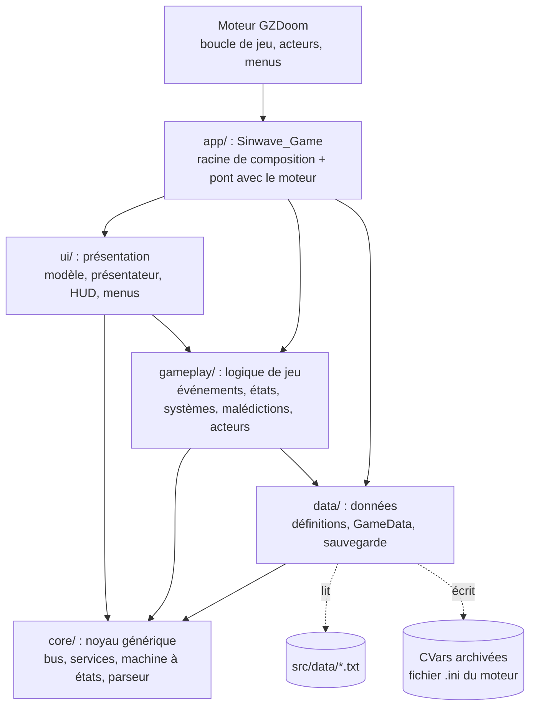
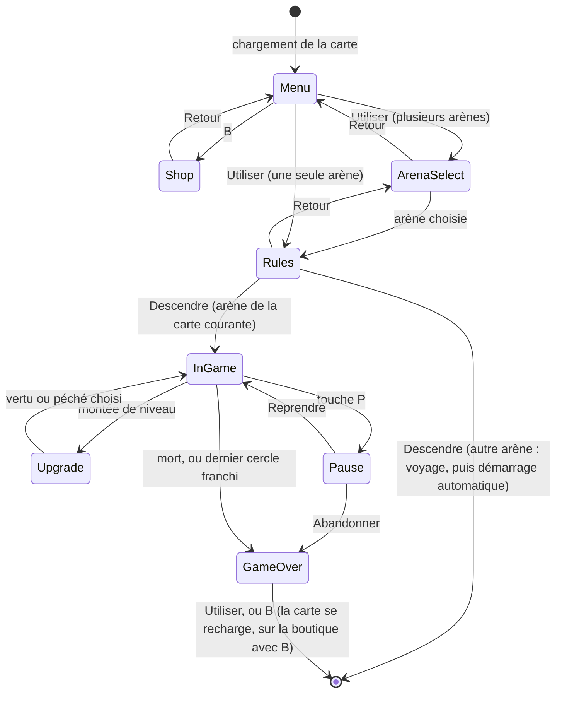
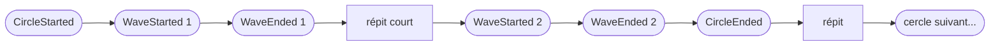
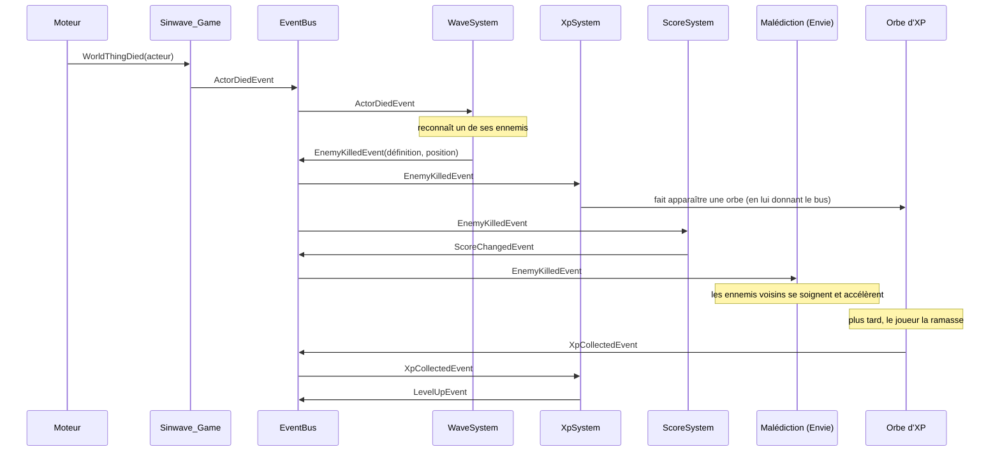
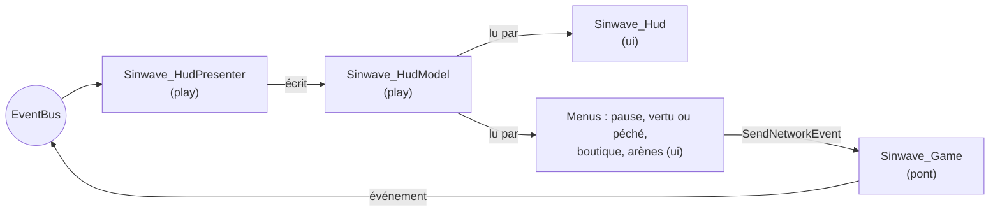

# Sinwave : architecture du prototype

Sinwave est le prototype du **projet Aegis** : un survivors-like sur le thème des sept péchés capitaux, écrit en **ZScript** pour le moteur **GZDoom 4.14.2**. Ce document justifie le choix du moteur (partie 2), puis explique **comment le code est organisé et pourquoi**, avec ses limites (partie 12) et ce qui viendrait avec plus de temps (partie 13).

GZDoom ne fournit ni machine à états de jeu, ni bus d'événements, ni équivalent des ScriptableObject : **toute l'architecture décrite ici est écrite dans le projet**, dans `src/zscript/`.

---

## 1. Le jeu en bref

- **Hors run :**
  - le joueur choisit une **arène** : Le Vestibule (la run minimale, 2 à 3 minutes), Le Purgatoire, Les Limbes, ou une arène personnalisée ;
  - il règle la **descente** : difficulté prédéfinie (Pèlerin, Pénitent, Damné, Enfer) ou **défi personnalisé** (vie, vitesse et rythme des ennemis, dégâts subis), et **cercle de départ**. La récompense suit la difficulté ;
  - il dépense ses **indulgences** à la **boutique** en armes et améliorations permanentes. Ses rayons s'ouvrent selon le **Jugement** de son âme, gardé d'une run à l'autre.
- **Une run :** le joueur traverse des **cercles**, un par péché. Chaque cercle impose une **malédiction** qui change les règles et enchaîne plusieurs **vagues** de plus en plus dures ; le dernier cercle se termine par un boss : **Charon** au Vestibule, **Lucifer** au Purgatoire.
- **À chaque niveau :** trois choix parmi des **vertus** (modestes, qui purifient), des **neutres** (meilleurs, sans toucher à l'âme, de plus en plus rares quand elle penche) et des **péchés** (puissants, avec un défaut, qui corrompent). Ils font pencher la **balance de l'âme** : la corruption part de 15, l'équilibre, et va de 0 (sainteté) à 30 (damnation). Plus elle s'en éloigne, plus la partie change, en trois paliers de chaque côté, et plus les choix suivants penchent du même côté. Le verdict final en découle : **Absolution**, **Purgatoire** ou **Damnation**.
- **À la fin :** les indulgences gagnées sont sauvegardées pour les runs suivantes, et le Jugement bouge selon l'âme.

### Ce qui distingue Sinwave des mods existants

Deux mods du même genre existent sur GZDoom : **DoomSurvivor** et **Doom2Survive**. Ils ont en commun des vagues sans fin, des orbes d'XP et des âmes à dépenser dans une boutique en cours de partie. Sinwave s'en écarte volontairement :

| | DoomSurvivor / Doom2Survive | Sinwave |
|---|---|---|
| Structure | Vagues sans fin | Descente finie : des cercles de quelques vagues chacun, un boss, une fin |
| Vagues | Plus d'ennemis à chaque vague | Les vagues se resserrent aussi, mais chaque cercle **change une règle** (malédiction) |
| Montée de niveau | Améliorations au hasard (Doom2Survive), armes qui montent en niveau (DoomSurvivor) | Choix moral **vertu, neutre ou péché**, qui fait pencher l'âme (ou non) : la partie change à chaque palier, et le verdict en dépend |
| Monnaie | Âmes, boutique en cours de partie | Indulgences, boutique **entre les runs** (méta-progression) |
| Contenu | Dans le code | Dans des **fichiers de données** ; arènes personnalisées sans code |
| Architecture | DoomSurvivor : un gestionnaire d'événements central qui gère vagues, difficulté et réinitialisations | Systèmes indépendants reliés par un bus d'événements, activables un par un |

---

## 2. Choix du moteur : pourquoi GZDoom

Le sujet note surtout l'**architecture** (états, bus, services, données, méta-progression) et demande une run jouable de 2 à 3 minutes. Il fallait donc un moteur qui fournisse vite un jeu de tir complet, sans faire l'architecture à notre place.

| | **GZDoom 4.14 (ZScript)** | Unity (C#) | Godot 4 (GDScript, C#) | Unreal 5 (C++, Blueprints) |
|---|---|---|---|---|
| Jeu de tir de base : déplacement, armes, monstres et leur IA, collisions, sons, menus, manette | **fourni** | à écrire, ou paquets de l'Asset Store | à écrire | modèle FPS fourni ; ennemis et vagues à écrire |
| Graphismes et sons | **Freedoom**, libre et redistribuable | à trouver ou à produire | à trouver ou à produire | à trouver ou à produire |
| Langage | ZScript : classes, héritage, méthodes virtuelles et abstraites, typage statique | C# | GDScript (typage facultatif), C# | C++, Blueprints |
| Architecture fournie par le moteur | presque rien : **tout est écrit dans le projet** | ScriptableObject, UnityEvent | signaux, autoloads | sous-systèmes, délégués |
| Poids | mod de 110 Ko, build Windows complet de 31 Mo | éditeur et build bien plus lourds | léger | très lourd |
| Itération | tout le ZScript compile en quelques secondes | recompilation et rechargement à chaque modification | rapide | compilation C++ longue |

**Pourquoi GZDoom :**
- **Le temps va à ce qui est noté.** Le jeu de tir existe déjà : pas de contrôleur de personnage, d'armes ni d'IA de monstres à écrire avant de pouvoir travailler l'architecture.
- **L'architecture ne peut pas être empruntée au moteur.** GZDoom n'a ni bus d'événements, ni machine à états de jeu, ni équivalent des ScriptableObject : tout ce que le sujet demande est écrit et visible dans `src/zscript/`.
- **ZScript est un vrai langage objet**, vérifié à la compilation et proche du C# : Observer, State, Stratégie et Service Locator s'y écrivent comme en Unity.
- **La séparation entre logique et affichage est garantie par le compilateur** : le code `ui` peut lire le jeu mais pas le modifier (partie 9).
- **Le genre s'y prête** : des vagues de monstres, des armes, de l'expérience. Deux mods survivors-like existent déjà sur GZDoom ; Sinwave s'en distingue par sa structure (partie 1).
- **Un build léger et libre** : GZDoom (GPL) et Freedoom (BSD) se redistribuent ; le build Windows tient dans un zip et se lance par un `.bat`.

**Pourquoi pas les autres :** Unity et Godot auraient donné plus de liberté (vraie 3D, éditeur, débogueur), mais il aurait fallu construire tout le jeu de tir avant d'arriver à ce qui est évalué. Unreal est surdimensionné pour un prototype court, et le C++ ralentit chaque essai.

**Ce que ce choix coûte (limites assumées) :**
- **ZScript n'a ni génériques, ni délégués, ni lambdas, ni constructeurs avec paramètres** : les abonnés du bus héritent d'une classe (`Sinwave_Listener`), et un Service Locator transmis remplace un conteneur d'injection (partie 6).
- **Ni débogueur, ni framework de test** : les tests unitaires et les scénarios de bout en bout sont écrits dans le projet. Ils ouvrent une fenêtre GZDoom, donc ne tournent pas sur le serveur d'intégration continue (partie 11).
- **Un moteur de 1993, en 2,5D** : cartes faites de secteurs, monstres en sprites, IA sans recherche de chemin. Les arènes doivent rester ouvertes (« Les cartes », partie 7).
- **ZScript ne peut pas écrire de fichier** : la méta-progression est sauvegardée dans des CVars, dans le `.ini` du moteur (partie 8).
- **Il faut un IWAD** (les données de base du jeu) : Freedoom est livré ; le vrai Doom II marche aussi, s'il est installé.
- **Pas d'inspecteur pour les données** : des fichiers texte remplacent les ScriptableObject, vérifiés seulement au chargement.

---

## 3. Par où commencer la lecture

| Ordre | Fichier | Ce qu'on y voit |
|---|---|---|
| 1 | `src/zscript/app/sinwave_game.zs` | Le point d'entrée : création de tous les objets, puis traduction des appels du moteur en événements. |
| 2 | `src/zscript/core/` | Les briques génériques : bus, Service Locator, machine à états, système de base, lecteur de données. |
| 3 | `src/zscript/gameplay/sinwave_events.zs` | Le catalogue de tous les événements du jeu. |
| 4 | `src/zscript/gameplay/states/` | Les états globaux et leurs transitions. |
| 5 | `src/zscript/gameplay/systems/` | Les systèmes de jeu. Chaque fichier commence par la liste de ce qu'il **écoute** et **publie**. |
| 6 | `src/zscript/gameplay/curses/` | Les sept malédictions (pattern Stratégie). |
| 7 | `src/data/` | Le contenu du jeu, sans code. |
| 8 | `src/zscript/ui/` | La présentation : modèle, présentateur, HUD et menus. |

---

## 4. Vue d'ensemble : les couches



Les flèches indiquent « dépend de ». Elles descendent toujours :
- le noyau ne connaît rien du jeu ;
- les données ne connaissent pas les systèmes. Une malédiction est référencée dans les données par le **nom** de sa classe, vérifié au chargement ;
- seule la couche `app` connaît toutes les classes concrètes.

| Dossier | Rôle | Classes principales |
|---|---|---|
| `app/` | Racine de composition : crée et relie tout. Seule classe déclarée au moteur (`MAPINFO`). | `Sinwave_Game` |
| `core/` | Briques réutilisables, sans règle de jeu. | `Sinwave_EventBus`, `Sinwave_Services`, `Sinwave_StateMachine`, `Sinwave_System`, `Sinwave_DataParser` |
| `data/` | Définitions chargées depuis les fichiers texte, et sauvegarde de la méta-progression. | `Sinwave_GameData`, `Sinwave_ArenaDef`, `Sinwave_CircleDef`, `Sinwave_UpgradeDef`, `Sinwave_ShopItemDef`, `Sinwave_SaveService` |
| `gameplay/` | Événements, états globaux, systèmes de jeu, malédictions, acteurs (orbe d'XP, point d'apparition). | `Sinwave_WaveSystem`, `Sinwave_CurseSystem`, `Sinwave_MetaSystem`, `Sinwave_InGameState`... |
| `ui/` | Présentation : un modèle de données d'affichage, le présentateur qui le remplit, le HUD et les menus qui le lisent. | `Sinwave_HudModel`, `Sinwave_HudPresenter`, `Sinwave_Hud`, `Sinwave_ShopMenu` |

Hors du code : `src/data/` (contenu), `src/maps/` (cartes), `tests/` (tests automatiques), `tools/` (build, lancement, tests, création d'arène, packaging).

**Patrons de conception utilisés :**

| Patron | Où | Rôle |
|---|---|---|
| Racine de composition | `Sinwave_Game` | Un seul endroit crée et relie tous les objets. |
| Observer (bus d'événements) | `Sinwave_EventBus` | Les systèmes communiquent sans se connaître. |
| Service Locator (transmis) | `Sinwave_Services` | Accès aux services sans singleton statique. |
| State | `Sinwave_StateMachine` + états | Les états globaux du jeu et leurs transitions. |
| Stratégie | `Sinwave_Curse` + 7 sous-classes | La règle de chaque cercle est interchangeable, choisie par les données. |
| Modèle-Présentateur-Vue | `ui/` | L'interface lit un modèle et n'agit que par des commandes. |
| Conception orientée données | `src/data/` | Tout le contenu est décrit hors du code. |

---

## 5. Déroulement du jeu

### Machine à états globale



| État | Classe | Rôle |
|---|---|---|
| Menu | `Sinwave_MenuState` | Écran titre avec la méta-progression. Utiliser mène au choix d'arène, B à la boutique. |
| ArenaSelect | `Sinwave_ArenaSelectState` | Choix de l'arène. |
| Rules | `Sinwave_RulesState` | Règles de la descente (difficulté, défi personnalisé, cercle de départ), traitées par `Sinwave_RulesSystem`. Descendre lance la run ; une arène sur une autre carte : voyage, puis la run démarre à l'arrivée. |
| Shop | `Sinwave_ShopState` | Boutique ouverte. Les achats sont traités par `Sinwave_MetaSystem`. |
| InGame | `Sinwave_InGameState` | Les cercles s'enchaînent. Surveille la mort, la victoire, la pause et les montées de niveau. |
| Pause | `Sinwave_PauseState` | Run suspendue, menu Reprendre / Abandonner. |
| Upgrade | `Sinwave_UpgradeState` | Run suspendue, choix d'une vertu ou d'un péché. |
| GameOver | `Sinwave_GameOverState` | Bilan et verdict. Utiliser recharge la carte ; B la recharge et ouvre la boutique. |

Pour qu'une action survive au changement de carte (lancer la run dans l'arène choisie, ouvrir la boutique), l'état la note dans une CVar non sauvegardée (`sinwave_onarrival`) juste avant le voyage. L'état Menu la lit à l'arrivée (`Sinwave_World.Travel` et `ConsumeArrival`).

**Pas de code dupliqué entre états :**
- Toutes les transitions passent par `Sinwave_StateMachine.ChangeState()`, qui appelle toujours `Exit()`, publie `StateChangedEvent`, puis appelle `Enter()`.
- Le début de run (`BeginRun`) et la fin de run (`EndRun`) sont écrits une seule fois, dans `Sinwave_GameState`.
- Pause et Upgrade héritent de `Sinwave_SuspendedState`, qui contient une seule fois le code de suspension et de reprise.

Les états **ne font pas le travail** : ils décident seulement des transitions. Quand la run démarre, ils publient `RunStartedEvent`, et ce sont les systèmes qui réagissent (cercles, joueur, XP, achats de la boutique...).

### Cercles et vagues

Une run traverse les cercles de l'arène (`data/waves/<arène>.txt`) ; chaque cercle enchaîne plusieurs vagues. `Sinwave_WaveSystem` publie le déroulé, et les autres systèmes s'y accrochent au bon niveau :



- **Malédiction :** `Sinwave_CurseSystem` l'active à `CircleStarted` et l'arrête à `CircleEnded` : elle dure tout le cercle, répits compris.
- **Indulgences :** `Sinwave_MetaSystem` compte les `CircleEnded` (cercles franchis).
- **Interface :** le haut de l'écran affiche « Cercle 3/7 : Luxure   vague 2/3   0:05 », et un bandeau annonce chaque cercle, puis chaque nouvelle vague.
- **Difficulté croissante :** les réglages d'un cercle (`interval`, `max`) sont ceux de sa première vague. Chaque vague suivante du cercle fait apparaître les ennemis plus vite et en autorise davantage (`Sinwave_CircleDef.IntervalTicsForWave`, `MaxAliveForWave`). La vie des ennemis grandit avec le rang de la vague dans l'arène (`Sinwave_GameData.WaveRank`), donc aussi d'un cercle à l'autre, quel que soit le cercle de départ. Les trois taux sont dans `data/progression.txt` ; le boss, réglé à part, n'est pas concerné.
- **Boss :** avec `boss = ...`, la dernière vague du cercle est celle du boss et dure jusqu'à sa mort.

### La run minimale : le Vestibule

Le sujet demande une run jouable de 2 à 3 minutes. C'est l'arène **Le Vestibule** (carte SW03, `data/waves/vestibule.txt`), la première du choix d'arène : un seul cercle (Paresse), deux vagues d'une minute, puis le boss **Charon**. Les vagues finissent à 2 min 07, et le combat contre Charon porte la run à 2 à 3 minutes. Elle traverse tout ce que le sujet demande :
- des vagues d'ennemis de plus en plus serrées ;
- le ramassage d'XP, les montées de niveau et le choix d'une amélioration (vertu, neutre ou péché) ;
- la balance de l'âme, la malédiction du cercle, le boss et sa rage ;
- le score final et le verdict ;
- la sauvegarde de la méta-progression : indulgences et Jugement, relus à la run suivante.

C'est la seule arène sous les 5 minutes de vagues : le Purgatoire et les Limbes durent 6 à 8 minutes. Rien dans le code ne la distingue des autres : elle n'existe que par ses données (`arenas.txt`, `waves/vestibule.txt`, le boss `charon` dans `enemies.txt`) et sa carte.

### Alerte d'attaque dans l'angle mort

Comme dans *Doom: The Dark Ages*, une marque rouge autour du viseur signale une attaque qui vient d'où le joueur ne regarde pas, **avant** l'impact. Deux côtés, qui ne se connaissent pas :
- **Jeu :** `Sinwave_ThreatSystem` repère, tous les 2 tics, les ennemis qui visent le joueur et prennent leur élan. Ce sont les premières images de leurs états `Missile` et `Melee` : 0,3 à 0,5 s où l'ennemi se tourne vers sa cible avant de tirer ou de frapper. Il repère aussi les projectiles ennemis qui foncent sur le joueur et l'atteindront dans moins d'une seconde (`threat_warning_seconds` dans `data/progression.txt`). Il publie `ThreatStarted`, puis `ThreatEnded` quand l'attaque est partie ou le projectile arrivé.
- **Interface :** le présentateur tient la liste des menaces dans le modèle. À chaque image, `Sinwave_Hud.DrawThreats` calcule l'angle de chaque source par rapport à la caméra (position et angle interpolés, fournis par le rendu). Il ne dessine que les sources hors du champ de vision, calculé depuis le FOV du joueur et le format de l'écran. La marque est placée sur un anneau autour du centre de la vue 3D : en haut devant, en bas derrière. Elle suit la source quand le joueur tourne, s'efface quand elle entre à l'écran, et disparaît à l'impact d'un projectile.

### La horde vise toujours le joueur

Dans un survivors-like, les ennemis foncent sur le joueur ; l'IA de Doom, elle, attend de le voir et se laisse distraire. `Sinwave_WaveSystem` corrige cela sans toucher aux monstres du moteur :
- **Apparition autour du joueur** (clé `spawn = player` de l'arène, par défaut) : à 550–850 unités, juste hors de portée, sur le sol du secteur. Une position hors de la carte ou dans un pilier est rejetée ; après 6 essais, on se rabat sur les points d'apparition de la carte. Avec `spawn = points`, seuls ces points servent.
- **Cible dès l'apparition** : l'ennemi reçoit le joueur comme cible et passe directement en poursuite.
- **Rappel de cible** chaque seconde : un ennemi qui a changé de cible ou qui erre est relancé sur le joueur.
- **`noinfighting`** dans `MAPINFO` : les monstres ne se battent plus entre eux quand ils se touchent par erreur.

### Exemple : un ennemi meurt



Aucun de ces systèmes ne connaît les autres : ils ne connaissent que le bus et les classes d'événements.

### Exemple : le boss entre en rage

`Sinwave_BossSystem` surveille la vie de Lucifer. Sous 50 %, il l'accélère et publie `SpawnRequestedEvent(pride, 3)`. C'est `Sinwave_WaveSystem` qui fait apparaître les renforts : le système du boss ne sait pas créer d'ennemis, il le demande.

---

## 6. Le noyau (`core/`)

### Bus d'événements (Observer)

Fichier : `core/sinwave_eventbus.zs`.

```c++
mBus.Subscribe(self, 'Sinwave_EnemyKilledEvent');        // s'abonner à un type
mBus.Publish(Sinwave_EnemyKilledEvent.Create(def, pos)); // publier
```

- Un abonnement porte sur une **classe d'événement et ses sous-classes**. Sans type, l'abonné reçoit tout (journal, présentateur, système de malédictions).
- La diffusion est **synchrone** : `Publish()` appelle les abonnés dans l'ordre d'abonnement avant de rendre la main. Un abonné peut publier à son tour (publication imbriquée).
- Un désabonnement pendant une diffusion est différé, pour ne pas casser la boucle en cours.
- ZScript n'a pas de délégués ni d'`event` comme C# : les abonnés héritent de `Sinwave_Listener` et redéfinissent `OnEvent()`.

Tous les événements sont regroupés dans `gameplay/sinwave_events.zs` : lire ce fichier suffit pour savoir tout ce qui peut se passer.

### Service Locator

Fichier : `core/sinwave_services.zs`. Services enregistrés par `Sinwave_Game` :

| Clé | Service | Rôle |
|---|---|---|
| `EventBus` | `Sinwave_EventBus` | Communication entre systèmes |
| `GameData` | `Sinwave_GameData` | Données du jeu et arène courante (lecture seule) |
| `Save` | `Sinwave_CVarSaveService` (derrière le contrat abstrait `Sinwave_SaveService`) | Sauvegarde de la méta-progression et des règles |
| `Rules` | `Sinwave_RunRules` | Règles choisies pour la run : écrites par `Sinwave_RulesSystem`, lues par les vagues, le joueur et la méta |
| `HudModel` | `Sinwave_HudModel` | Données affichées par l'interface |

**Pourquoi ce choix :** le sujet interdit un singleton statique accessible de partout. Le Service Locator est **créé par la racine de composition puis transmis** à chaque état, système et malédiction lors de sa création (`Init(services)`) : aucun code ne peut le retrouver par un accès global. Chaque service fournit un raccourci typé (`Sinwave_GameData.From(services)`).

**Pourquoi pas une injection de dépendances complète :** ZScript n'a ni constructeurs paramétrés, ni génériques utilisateur, ni réflexion suffisante pour un conteneur d'injection. Passer un seul objet reste simple, explicite, et permet de remplacer un service en enregistrant un autre objet sous la même clé.

**Limites assumées :**
- Les dépendances d'un système ne se voient pas dans sa signature : il faut lire son `Setup()`. C'est pourquoi chaque fichier de système commence par la liste de ce qu'il utilise.
- Une clé mal écrite n'est détectée qu'à l'exécution (message dans la console).

### Machine à états, systèmes, lecteur de données

- `core/sinwave_statemachine.zs` : machine générique, elle ne connaît que `Sinwave_State`. Elle écoute tout le bus et transmet chaque événement à l'état courant (`HandleEvent`).
- `core/sinwave_system.zs` : un système reçoit uniquement le Service Locator. Son cycle de vie :
  1. `Setup()` : il récupère ses services et s'abonne au bus ;
  2. `Start()` : une fois tous les systèmes prêts, il fait ses premières publications ;
  3. `Tick()` : il travaille à chaque tic de jeu (35 par seconde).
- `core/sinwave_dataparser.zs` : format texte `[type identifiant]` puis `clé = valeur`. Les erreurs de saisie sont signalées avec le fichier et la ligne.

---

## 7. Conception orientée données

Tout le contenu du jeu est décrit dans `src/data/`. Le code ne contient **aucun** ennemi, cercle, vertu, péché, article ou arène en dur.

| Fichier | Contenu | Lu par |
|---|---|---|
| `systems.txt` | Systèmes à créer, dans quel ordre, activés ou non | `Sinwave_Game` |
| `arenas.txt` | Arènes : carte, fichier de cercles, règles (vie, vitesse, rythme, récompense), mode d'apparition des ennemis | `Sinwave_GameData`, choix d'arène |
| `waves/*.txt` | Cercles d'une arène : nombre et durée des vagues, répits, rythme, malédiction, boss, tirage pondéré des ennemis | `Sinwave_WaveSystem`, `Sinwave_CurseSystem` |
| `enemies.txt` | Les 7 péchés, le boss et le reflet damné : classe du moteur, vie, vitesse, taille, couleur, XP, score, rage | `Sinwave_WaveSystem`, `Sinwave_BossSystem` |
| `curses.txt` | Les 7 malédictions : texte, classe de comportement, réglages | `Sinwave_CurseSystem` |
| `upgrades.txt` | 8 vertus, 7 neutres et 7 péchés : famille, effets, corruption, maximum par run | `Sinwave_UpgradeSystem` |
| `soul.txt` | Balance de l'âme : bornes, équilibre, butin des ennemis selon l'âme, paliers et leurs effets, pente des choix, force du boss, épreuves | `Sinwave_CorruptionSystem`, `Sinwave_LootSystem`, `Sinwave_UpgradeSystem`, `Sinwave_WaveSystem`, `Sinwave_SoulTrialSystem` |
| `shop.txt` | Armes et améliorations permanentes : rayon, palier du Jugement demandé, prix, progression du prix, niveaux, effets | `Sinwave_MetaSystem` |
| `judgement.txt` | Jugement de l'âme : bornes, neutralité, seuils des rayons de la boutique, déplacement en fin de run | `Sinwave_MetaSystem`, boutique |
| `difficulties.txt` | Difficultés prédéfinies : vie, vitesse et rythme des ennemis, dégâts subis | `Sinwave_RulesSystem` |
| `progression.txt` | Courbe d'XP, composition des choix (vertus, péchés, choix libres), gains d'indulgences (dont le bonus de chaque verdict), équipement, montée de la difficulté d'une vague à l'autre, alerte des projectiles | plusieurs systèmes |

Exemple, un péché (`upgrades.txt`) :

```ini
[upgrade sin_wrath]
name        = Colère
description = +40 % de dégâts, mais tu subis +25 % de dégâts
kind        = sin
corruption  = 3
effects     = damage:0.4, vulnerability:0.25
max         = 2
```

C'est l'équivalent des ScriptableObject d'Unity. Chaque bloc devient une définition (`Sinwave_UpgradeDef`...), vérifiée au chargement par `Sinwave_GameData` : classe du moteur inexistante, cercle qui cite un ennemi ou une malédiction inconnus, identifiant en double...

**Un seul langage d'effets** (`maxhealth`, `heal`, `armor`, `damage`, `vulnerability`, `speed`, `regen`, `magnet`, `xpgain`, `give`, `aura`, `infiniteammo`) sert aux vertus, aux péchés, aux articles de la boutique, aux malédictions et aux paliers de l'âme. Tous passent par le même événement `EffectGrantedEvent`, appliqué par un seul système : `Sinwave_PlayerSystem` ou `Sinwave_XpSystem`. Un effet temporaire se retire en publiant son inverse (`Sinwave_Effect.Negated()`).

**Ce qu'on peut ajouter sans code :**
- un ennemi, une vertu, un péché ou un article de boutique ;
- un cercle ou une arène complète : voir [CREER-UNE-ARENE.md](CREER-UNE-ARENE.md) et `tools/new-arena.ps1`.

**Ce qui demande du code :** un nouveau type d'effet, dans `Sinwave_Effect.IsKnownType()` et dans le système qui l'applique, ou une nouvelle malédiction, dans une sous-classe de `Sinwave_Curse`.

**Modding :** un fichier placé au même chemin dans une archive chargée après `sinwave.pk3` remplace l'original. Les tests automatiques s'en servent pour raccourcir les cercles sans modifier le jeu.

### Les malédictions : pattern Stratégie

`data/curses.txt` associe chaque malédiction à une classe ZScript et à ses réglages :

```ini
[curse greed]
name        = Avarice
description = Les orbes d'expérience disparaissent au bout de 3 secondes
class       = Sinwave_GreedCurse
lifetime    = 3
```

Au début d'un cercle, `Sinwave_CurseSystem` crée l'objet de la classe indiquée (`Sinwave_Curse`), l'active et lui transmet les événements du bus jusqu'à la fin du cercle. Le système ne sait pas ce que fait la malédiction.

Une malédiction qui touche le joueur publie un `EffectGrantedEvent` temporaire, annulé à la fin du cercle. Exemple : Paresse applique −25 % de vitesse, puis +25 % à la fin.

Une malédiction qui change les ennemis doit toujours les rendre tels qu'elle les a trouvés. Exemple : la Colère retient la couleur et la vitesse d'origine de chaque ennemi enragé et les lui rend au bout de 3 s, ou à la fin du cercle. Chaque ennemi n'enrage qu'**une fois** : sous un tir continu, une rage relancée à chaque coup le laisserait rouge jusqu'à sa mort.

### Les cartes : générées, d'après Dante et les modes de survie

Les trois cartes sont des créations originales, calculées par `tools/generate-arena.ps1` (format UDMF) plutôt que dessinées à la main : on peut les régénérer, les régler par quelques nombres, et `new-arena.ps1` en part pour les arènes des joueurs.

**Principes de level design**, repris des modes de survie existants (zombies de Call of Duty, mode Horde de Doom Eternal, Serious Sam, Vampire Survivors) :
- des **boucles** pour faire tourner la horde en rond, sans cul-de-sac où se faire coincer (d'où des anneaux et des octogones, pas de coins) ;
- des **obstacles qui coupent les tirs** des zombies et des mitrailleurs, sans fermer l'espace ;
- des **passages étroits** (portes, abords des tombeaux) où la horde se tasse : le fusil à pompe y est roi ;
- des **zones reconnaissables** au sol, à la lumière et à sa couleur, et un repère au centre.

**Les trois plans**, d'après la géographie de Dante :

| Carte | Plan | Ce qui sert au jeu |
|---|---|---|
| SW02, le Purgatoire (`Funnel`) | L'entonnoir de l'Enfer : un bord hérissé de 8 aiguilles de roche, les 6 tombeaux ardents, le fleuve de sang (Phlégéthon), et au centre le lac gelé du Cocyte avec 4 piliers de feu bleu | Chaque terrasse est une boucle ; on descend vers le boss d'une marche à la fois ; les piliers du lac cachent du boss, les tombeaux coupent les tirs |
| SW01, les Limbes (`Castle`) | Le noble château : un champ obscur, le fossé, un rempart percé de 7 portes (pas au sud), et au centre la prairie avec un temple de 4 colonnes et 7 arbres | Trois boucles (champ, chemin de ronde, prairie) ; les portes font se tasser la horde ; le mur sans porte au sud force à tourner |
| SW03, le Vestibule (`Vestibule`) | L'antichambre de l'Enfer : on entre par la porte, au nord ; une plaine de cendre où courent les tièdes ; l'Achéron, le fleuve de Charon, qui barre le sud ; et l'autre rive | Une seule grande plaine pour une run courte : on voit venir la horde de loin ; cinq rochers à contourner coupent les tirs ; coins coupés, sans cul-de-sac |

**Contraintes du moteur :**
- marches de 24 unités au plus : les monstres ne montent ni ne descendent plus haut ;
- obstacles pleins : des trous dans la carte ; blocs bas (tombeaux, rempart) : des secteurs plus hauts ;
- ciel à la même hauteur partout : deux ciels à des hauteurs différentes laissent des bandes au raccord ;
- textures et sols présents à la fois dans Doom II et dans Freedoom.

**Apparition des ennemis :** `Sinwave_WaveSystem` refuse une position sur un plateau plus haut d'une marche que tout ce qui l'entoure (`CanWalkOff`) : un monstre posé sur un tombeau ou sur le rempart ne saurait pas en descendre.

---

## 8. Méta-progression et boutique

- **Données :** `Sinwave_MetaData` : indulgences, meilleur score, nombre de runs, Jugement, et niveau de chaque article acheté.
- **Stockage :** `Sinwave_CVarSaveService`.
  - Il écrit des CVars archivées (déclarées dans `CVARINFO`), dont les achats sous forme de texte : `shotgun=1;vigor=3`.
  - Il force l'écriture du fichier `.ini` du moteur (`CVar.SaveConfig()`).
- **Découplage :** `Sinwave_MetaSystem` ne dépend que du contrat abstrait `Sinwave_SaveService`. Il ne connaît ni les cercles, ni le score, ni la corruption : il retient les valeurs annoncées sur le bus (`ScoreChangedEvent`, `CircleEndedEvent`, `CorruptionChangedEvent`).
- **Gagner :** à la fin de la run, les indulgences viennent du score, des cercles franchis et du bonus de victoire, qui dépend du verdict. Le tout est multiplié par la récompense de l'arène.
- **Dépenser :** en état Shop, `ShopBuyRequestedEvent` fait vérifier que l'article est ouvert par le Jugement, puis le prix (qui augmente à chaque niveau) et le niveau maximum. L'achat est ensuite sauvegardé. Le résultat est annoncé par `PurchaseEvent`, que la boutique affiche.
- **Appliquer :** au début de chaque run, chaque niveau acheté publie ses effets (`EffectGrantedEvent`), par le même chemin que les vertus.
- **Après le chargement d'une sauvegarde de partie** (`GameLoadedEvent`) : il relit les CVars.

### Balance de l'âme, paliers et verdict

La corruption est une balance (`data/soul.txt`) : elle va de 0 (sainteté) à 30 (damnation) et chaque run commence à 15, l'équilibre, sans aucun effet. Les péchés la font monter (+3 ou +4), les vertus la font descendre (-3, ou -5 pour Pénitence). Plus elle s'éloigne de l'équilibre, plus la partie change :

| Âme | Palier | Effets |
|---|---|---|
| 0 | Sainteté | **Aura sainte** : les ennemis proches brûlent ; -5 % de dégâts |
| ≤ 5 | Bénédiction | Régénération, +15 PV max ; -5 % de vitesse |
| ≤ 10 | Piété | -10 % de dégâts subis ; -5 % de dégâts |
| 15 | équilibre | aucun effet |
| ≥ 20 | Souillure | +10 % de dégâts ; -10 PV max |
| ≥ 25 | Perdition | +15 % de dégâts, +10 % de vitesse ; +10 % de dégâts subis |
| 30 | Damnation | **Munitions infinies** ; encore -10 PV max |

Les effets s'additionnent : au bout de la balance, le damné a +25 % de dégâts et -20 PV max, le saint -10 % de dégâts et +15 PV max. Les extrêmes restent des choix forts, pas des punitions.

- **Petits changements, à chaque point :** `Sinwave_LootSystem` fait lâcher aux ennemis tués un soin ou des munitions (celles de l'arme en main). Les chances partent de 8 % chacune à l'équilibre : vers le péché, plus de munitions et un peu moins de soins ; vers la vertu, l'inverse. Les chargeurs que les monstres de Doom lâchent d'eux-mêmes sont retirés (`monster_drops`), pour que le butin ne dépende que de l'âme ; leurs armes restent.
- **Grands changements, à chaque palier :** les paliers d'un même côté s'additionnent. `Sinwave_CorruptionSystem` publie les effets d'un palier atteint et, s'il est perdu, leur inverse ; un bandeau l'annonce (`SoulTierChangedEvent`). Au début d'une run, les paliers ne sont appliqués qu'au tic suivant, après la remise à zéro du joueur : l'ordre de diffusion de `RunStarted` n'est pas garanti.
- **Nouveaux effets :** `aura` (dégâts par seconde aux ennemis à moins de 200 unités, avec une onde de lumière dorée) et `infiniteammo` (un bonus `PowerInfiniteAmmo` du moteur, sans fin utile, retiré avec le palier).
- **Trois familles de choix :** chaque montée de niveau propose une vertu, un péché et un choix libre (`data/progression.txt`). Les **neutres** se placent entre les deux : un bonus meilleur que celui d'une vertu, moins fort que celui d'un péché, sans défaut, et l'âme ne bouge pas (ce sont les vertus des païens des Limbes : Force, Justice, Prudence...). Le choix libre est neutre avec une chance de 80 % à l'équilibre (`offer_neutral_chance`), qui baisse à mesure que l'âme penche jusqu'à 0 au bout de la balance (`Sinwave_SoulDef.Lean`).
- **Pente glissante, dans les deux sens :** s'il n'est pas neutre, la clé `temptation` d'un palier atteint tire le choix libre vers le camp de l'âme : deux péchés pour une âme corrompue, deux vertus pour une âme pure, au hasard à l'équilibre. Un neutre tiré compte comme ce choix : la vertu et le péché restent toujours proposés (`Sinwave_UpgradeSystem.OfferSplit`). Le menu les range dans l'ordre de la balance : vertu, neutre, péché.
- **Le boss suit l'âme, à l'inverse :** `boss_health` et `boss_escort` des paliers atteints règlent la vie du boss (Charon ou Lucifer) et le nombre d'ennemis autour de lui (sa vague et ses renforts de rage). Âme pure : boss jusqu'à +50 % de vie, mais moitié moins d'ennemis. Âme damnée : boss à -30 % de vie, mais +70 % d'ennemis. `Sinwave_WaveSystem` retient la dernière corruption annoncée ; une demande de renforts porte le drapeau `escort`.
- **Épreuves, au bout de la balance :** `Sinwave_SoulTrialSystem` compte le temps passé à 0 ou à 30 (hors pause et menus). Au bout de `trial_seconds` (20 s), une fois par séjour :
  - côté péché, il demande l'apparition du **reflet damné** (`SpawnRequested`), un mini-boss rouge qui rapporte 80 XP ;
  - côté vertu, un **ange** soigne le joueur (`EffectGranted` heal), dans une gerbe de lumière dorée.

  `SoulTrialEvent` fait afficher un bandeau. Quitter le bout de la balance remet le compte à zéro.
- **Verdict :** un palier du péché atteint en fin de run, Damnation ; un palier de la vertu, Absolution ; sinon, Purgatoire. La règle est écrite **une seule fois**, dans `Sinwave_CorruptionChangedEvent.Verdict()`, et utilisée par la méta-progression (bonus de victoire : 20, 12 ou 5 indulgences) comme par l'interface.
- **Interface :** une jauge sous la barre d'XP, avec l'équilibre au milieu, la vertu en or vers la gauche, le péché en violet vers la droite, et un trait par palier. L'écran se teinte de rouge vers le péché, d'une lueur dorée vers la vertu.
- **Débogage :** avec `sinwave_debug 1`, `netevent sinwave_soul 5` (ou `-5`) décale l'âme sans passer par un choix, pour essayer les paliers.

### Le Jugement : une boutique à quatre rayons

Le Jugement (`data/judgement.txt`) est la balance de l'âme **d'une run à l'autre** : de 0 (Grâce) à 100 (Corruption), neutre à 50, sauvegardé dans une CVar (`sinwave_meta_judgement`), avec sa valeur d'avant la dernière run (`sinwave_meta_judgement_last`) pour montrer le chemin parcouru.

- **Il bouge en fin de run**, selon le palier de l'âme atteint : +6, +10 ou +15 vers la Corruption (Souillure, Perdition, Damnation), autant vers la Grâce (Piété, Bénédiction, Sainteté). Une run restée sans palier le ramène de 4 vers le neutre. L'écran de fin l'affiche (`Jugement : 50 -> 65`).
- **Il ouvre les rayons** de la boutique (`side` et `tier` de `data/shop.txt`) :

| Rayon | Esprit | Ouvert quand le Jugement est... |
|---|---|---|
| Armurerie | armes de départ | toujours |
| Grâce | le bien protège : vie, armure, défense, soins, aura ; super fusil, fusil à plasma | ≤ 40 (I), ≤ 25 (II), ≤ 10 (III) |
| Équilibre | objets compensés, un peu des deux | entre 35 et 65 |
| Corruption | le mal frappe : dégâts, vitesse, XP ; lance-roquettes, BFG | ≥ 60 (I), ≥ 75 (II), ≥ 90 (III) |

- Plus le palier est haut, meilleurs sont les objets. Un objet se verrouille si le Jugement repasse le seuil, mais **un objet acheté une fois reste débloqué** : on peut continuer à le monter en niveau.
- **Une seule règle, un seul endroit :** `Sinwave_JudgementDef` (`Tier`, `IsUnlocked`, `CanBuy`, `AfterRun`) sert à la méta-progression, qui refuse un achat verrouillé et déplace le Jugement, comme au présentateur, qui grise les articles verrouillés et affiche la condition (« Grâce III : Jugement 10 ou moins »).
- **Interface :** la boutique s'ouvre sur le rayon du Jugement. Gauche/Droite, ou un clic sur un onglet, change de rayon (`TabCount`, `SelectTab` de `Sinwave_ChoiceMenu`). Une longue liste resserre ses lignes pour rester au-dessus de la barre d'état.
- **La jauge du Jugement**, sous le titre de la boutique, est dessinée comme la balance de l'âme pendant la run :
  - la Grâce en or à gauche, la Corruption en violet à droite, remplies depuis le neutre ;
  - une zone par palier, de plus en plus marquée vers les extrêmes, avec son nom en dessous (I, II, III, Équilibre), allumé quand le Jugement l'atteint ;
  - la dernière run : l'ancienne position, le chemin parcouru sous la barre, et « Jugement : 50 -> 60 » au-dessus ;
  - pour l'article verrouillé choisi, la zone qui l'ouvrirait clignote, et sa description dit combien de points il manque (« encore 10 »).

  Le menu ne fait que dessiner : les seuils et la zone de chaque article (`Sinwave_JudgementDef.Range`, `Distance`) arrivent dans le modèle, par le présentateur. `Sinwave_ChoiceMenu` offre à chaque menu un bloc sous le titre (`HeaderExtraHeight`, `DrawHeaderExtra`).

---

## 9. Présentation séparée de la logique

ZScript sépare le code en deux **portées**, vérifiées par le compilateur :
- **play** : la simulation, déterministe ;
- **ui** : l'affichage et les menus.

Le code ui peut **lire** les objets play, mais **pas les modifier**. L'architecture s'appuie sur cette règle :



- Le **présentateur** est un système comme les autres : il traduit les événements en données d'affichage.
- Le **HUD** et les **menus** ne font que lire le modèle. Pour agir (choisir, acheter, reprendre), un menu envoie une **commande réseau**, que `Sinwave_Game` traduit en événement côté jeu. C'est le seul chemin de l'interface vers le jeu.
- Les cinq menus (pause, vertu ou péché, boutique, arènes, règles) héritent de `Sinwave_ChoiceMenu` : navigation, réglage gauche/droite, dessin et fermeture automatique sont écrits une fois. Chaque menu ne décrit que ses options ; il déclare s'il a un bouton *Retour* (`HasBackButton`) et quelles options se règlent (`IsAdjustable`).
- **Clavier, souris et manette** passent par le même chemin. La manette et le clavier arrivent en actions de menu (`MenuEvent` : haut, bas, gauche, droite, Entrée, Retour), que le moteur produit lui-même pour la croix, le stick gauche, A et B. La souris est gérée par `Sinwave_ChoiceMenu` : au dessin, le menu retient la zone de chaque option, de chaque valeur et du bouton *Retour*. Survol, clic, molette et clic droit appellent ensuite les mêmes fonctions que les touches (`Move`, `AdjustSelected`, `Confirm`, `GoBack`). Un clic n'agit qu'au relâchement, sur la zone où il a commencé : un tir en cours à l'ouverture d'un menu ne choisit rien.
- `Sinwave_Canvas` place textes et cadres sur un écran de 400 unités de haut, en pixels réels. L'écran virtuel de GZDoom (`DTA_VirtualWidth`) est évité : il suppose un format 4:3 et, sur un écran large, resserrait les textes vers le centre, hors de leurs cadres et des zones cliquables.
- Quand une touche ouvre un menu (B, Utiliser), son relâchement arrive au menu tout juste ouvert, et le moteur peut le traduire en action (Entrée...). `Sinwave_ChoiceMenu` ignore donc l'action produite par une touche relâchée sans avoir été enfoncée dans le menu, **pendant ce tic seulement** : une vraie touche du joueur juste après (Échap pour ressortir de la boutique) n'est jamais avalée.
- `Sinwave_Game.InputProcess` lit les touches de la boutique et de la pause directement, avant le moteur, selon l'écran affiché :
  - la touche liée dans *Options → Commandes → Sinwave* marche toujours ;
  - B et P marchent aussi tant qu'elles ne sont liées à rien d'autre. GZDoom n'applique les `defaultbind` de `KEYCONF` que s'il ne connaît pas encore la section Sinwave de sa configuration : une liaison perdue ne se répare pas seule, et les touches ne doivent pas en dépendre ;
  - manette : B ouvre la boutique ; Start met en pause pendant la run, et garde ailleurs son rôle d'ouverture du menu de GZDoom (options, quitter). Dans le menu pause, P et Start reprennent la run.
- La manette est désactivée par défaut dans GZDoom (`use_joystick`). Plutôt que de modifier ce réglage global depuis le code du mod, ce sont les lanceurs (`tools/run.ps1`, et les `.bat` du build) qui l'activent.
- Les menus du moteur survivent aux changements de carte, mais pas le modèle qu'ils affichent. `Sinwave_UiController` ferme donc tout menu resté lié au modèle d'une carte précédente : sinon, il bloquerait le jeu en pause.
- Un menu ouvert **met le moteur en pause** : pendant les états Pause et Upgrade, monstres et joueur sont figés.

---

## 10. Découplage : qui dépend de quoi

Aucun système ne référence un autre système. Chacun ne connaît que des services et des événements :

| Système (`data/systems.txt`) | Services | Écoute | Publie |
|---|---|---|---|
| `debug` : `Sinwave_EventLogger` | EventBus | tout | rien |
| `rules` : `Sinwave_RulesSystem` | EventBus, GameData, Save, Rules | RuleAdjusted, ArenaChosen | RulesChanged |
| `waves` : `Sinwave_WaveSystem` | EventBus, GameData, Rules | RunStarted, RunSuspended, RunResumed, RunEnded, ActorDied, SpawnRequested, CorruptionChanged | CircleStarted, CircleEnded, WaveStarted, WaveEnded, AllCirclesCleared, EnemyKilled, BossSpawned, BossDefeated |
| `curses` : `Sinwave_CurseSystem` | EventBus, GameData | tout (transmis à la malédiction active) | CurseStarted, CurseEnded, EffectGranted |
| `boss` : `Sinwave_BossSystem` | EventBus | BossSpawned, BossDefeated, RunEnded | BossHealthChanged, BossEnraged, SpawnRequested |
| `xp` : `Sinwave_XpSystem` | EventBus, GameData | RunStarted, RunEnded, EnemyKilled, XpCollected, EffectGranted | XpOrbDropped, XpChanged, LevelUp |
| `upgrades` : `Sinwave_UpgradeSystem` | EventBus, GameData | RunStarted, RunEnded, LevelUp, UpgradePicked, CorruptionChanged | UpgradeOffered, UpgradeChosen, EffectGranted |
| `corruption` : `Sinwave_CorruptionSystem` | EventBus, GameData | RunStarted, RunEnded, UpgradeChosen, SoulShift | CorruptionChanged, SoulTierChanged, EffectGranted |
| `score` : `Sinwave_ScoreSystem` | EventBus | RunStarted, RunEnded, EnemyKilled | ScoreChanged |
| `player` : `Sinwave_PlayerSystem` | EventBus, GameData, Rules | RunStarted, RunEnded, RunSuspended, RunResumed, EffectGranted | rien |
| `meta` : `Sinwave_MetaSystem` | EventBus, GameData, Save, Rules | RunStarted, RunEnded, ScoreChanged, CircleEnded, CorruptionChanged, ShopBuyRequested, GameLoaded | MetaLoaded, MetaSaved, Purchase, EffectGranted |
| `threats` : `Sinwave_ThreatSystem` | EventBus, GameData | RunStarted, RunEnded, RunSuspended, RunResumed | ThreatStarted, ThreatEnded |
| `loot` : `Sinwave_LootSystem` | EventBus, GameData | RunStarted, RunEnded, CorruptionChanged, EnemyKilled, ItemSpawned | rien |
| `trials` : `Sinwave_SoulTrialSystem` | EventBus, GameData | RunStarted, RunEnded, RunSuspended, RunResumed, CorruptionChanged | SoulTrial, SpawnRequested, EffectGranted |
| `hud` : `Sinwave_HudPresenter` | EventBus, GameData, HudModel | tout | rien |

Le pont `Sinwave_Game` publie les événements venus du moteur et de l'interface :
- du moteur : `ActorDied`, `PlayerDied`, `ActorDamaged` (dégâts infligés par le joueur), `ItemSpawned` (objets ramassables), `GameLoaded` ;
- de la touche Utiliser : `Confirm` ;
- des touches de la boutique et de la pause (`InputProcess`) : les commandes `sinwave_shop` et `sinwave_pause`, qui deviennent `ShopRequested` et `PauseRequested` ;
- de l'interface : `PauseRequested`, `ResumeRequested`, `AbandonRequested`, `ShopRequested`, `BackRequested`, `UpgradePicked`, `ShopBuyRequested`, `ArenaChosen`, `RuleAdjusted`, `DescendRequested`.

**Désactiver ou remplacer un système :** `enabled = false` ou une autre `class =` dans `data/systems.txt`. Le test automatique le prouve : il joue des runs complètes avec le système `hud` désactivé. Sans interface pour choisir, `Sinwave_UpgradeState` prend automatiquement la première proposition au bout de 2 secondes.

Ce que la désactivation change pour chaque système :
- **curses** : les cercles n'ont plus de règle spéciale ;
- **boss** : les boss n'entrent plus en rage ;
- **corruption** : l'âme reste à l'équilibre, sans palier ; le verdict est toujours Purgatoire ;
- **loot** : les ennemis ne lâchent plus que ce que Doom leur fait lâcher ;
- **score** : les indulgences ne viennent plus que des cercles ;
- **xp** : plus de montée de niveau ;
- **meta** : rien n'est sauvegardé et la boutique ne vend plus rien ;
- **threats** : plus d'alerte d'attaque dans l'angle mort ;
- **trials** : ni reflet damné ni ange au bout de la balance ;
- **waves** : aucun ennemi.

---

## 11. Outils et tests

| Commande (dossier `tools/`) | Rôle |
|---|---|
| `check.ps1` (Ctrl+Maj+B dans VS Code) | Construit le `.pk3` et vérifie que le ZScript compile. Les erreurs vont dans l'onglet *Problèmes* de VS Code. |
| `test.ps1` | Tests automatiques de bout en bout (voir ci-dessous). `-Iwad doom2` : les mêmes, sur le vrai Doom II. |
| `run.ps1` / `play.ps1` | Construit puis lance le jeu, manette activée. `-Iwad doom2` : avec le vrai Doom II. |
| `new-arena.ps1` | Crée une arène personnalisée (carte, cercles, réglages). |
| `generate-arena.ps1` | Génère une carte : l'entonnoir de l'Enfer (`Funnel`), le château des Limbes (`Castle`) ou le vestibule de l'Enfer (`Vestibule`). |
| `package.ps1` | Build Windows à rendre : `dist/Sinwave-win64.zip`, avec un lanceur Freedoom et un lanceur Doom II. |
| `create-shortcuts.ps1` | Raccourcis du bureau : « Sinwave - Travailler », « Sinwave - Jouer (Freedoom) », « Sinwave - Jouer (Doom II) ». |
| `workspace.ps1` | Ouvre VS Code, Ultimate Doom Builder, SLADE et Claude (raccourci du bureau). |

### Freedoom et le vrai Doom II

Le mod n'utilise que ce que Doom II et Freedoom Phase 2 ont en commun : les classes des monstres et des armes, les noms des textures, des sols, des ciels et des musiques. Le même `sinwave.pk3` tourne donc sur les deux, et les tests passent sur les deux (`test.ps1`, puis `test.ps1 -Iwad doom2`).

- **Livré :** Freedoom seulement, seul IWAD redistribuable. Doom II est un jeu commercial : il n'est jamais copié dans le build.
- **Trouvé :** `Find-Doom2Iwad` (`tools/config.ps1`) cherche `SINWAVE_DOOM2`, puis `DoomTools/iwads/doom2.wad`, puis les installations GOG et Steam, par le registre de Windows : un jeu déplacé sur un autre disque est retrouvé. La version DOS d'origine passe avant les rééditions (Unity, KEX), que GZDoom sait aussi lire. Dans le build rendu, c'est GZDoom qui cherche lui-même `doom2.wad` (GOG, Steam, dossier du jeu) ; s'il ne le trouve pas, il propose les jeux qu'il a trouvés.
- **Progression commune :** GZDoom range les réglages et les CVars de la méta-progression par famille de jeu (section `Doom` de son `.ini`), la même pour Freedoom et Doom II.
- **Doom 1 ne suffit pas :** le chevalier de l'Enfer (Orgueil), le soldat à la mitrailleuse (Avarice), le super fusil de la boutique, les sols `RROCK` des cartes et les musiques n'existent que dans Doom II.

**`test.ps1`** lance GZDoom avec l'archive `tests/smoke` par-dessus le jeu : deux arènes de test, avec des cercles courts. Il joue quatre scénarios par la console du moteur :
1. **victoire** :
   - choix d'arène, puis un cercle maudit (Paresse) de deux vagues ;
   - XP, montée de niveau, choix, pause ;
   - cercle du boss, réduit à sa vague (Orgueil + Lucifer), victoire, verdict ;
   - sauvegarde, rechargement de la carte et relecture de la méta ;
2. **mort** : boutique refusée pendant la run, mort du joueur, sauvegarde, puis boutique ouverte depuis l'écran de fin ;
3. **boutique** :
   - deux achats réussis (Armurerie, Équilibre), un achat refusé (déjà acquis) et un article verrouillé par le Jugement neutre (Grâce), retour au menu ;
   - choix de l'autre arène, défi personnalisé (vie des ennemis +25 %) et départ au cercle 2 ;
   - voyage vers l'autre carte, démarrage automatique au cercle 2 ;
   - les achats s'appliquent au début de la run ;
4. **interface** : les trois premiers scénarios désactivent l'interface ; celui-ci la réactive (archive `tests/ui`). Il vérifie qu'aucun menu ne reste bloqué après un changement de carte et que B ouvre la boutique depuis l'écran de fin.

Le script vérifie dans le journal que chaque événement attendu apparaît, dans l'ordre. Le jeu des tests ne se met pas en pause quand sa fenêtre passe à l'arrière-plan (`i_pauseinbackground`) : sans ça, cliquer ailleurs pendant les tests les bloquait jusqu'au délai maximal. Il exécute aussi **77 tests unitaires** (`tests/smoke/zscript/sinwave_unittests.zs`) sur :
- le bus, les services et la machine à états ;
- le lecteur de données, les poids du tirage des ennemis et les effets ;
- les vagues d'un cercle : montée en difficulté, vague du boss, rang dans l'arène ;
- les menaces : ennemi qui prend son élan, projectile qui arrive, qui s'éloigne ou qui est encore loin ;
- vertus, neutres et péchés, prix de la boutique, enregistrement des achats ;
- le tirage des choix de niveau : un neutre à l'équilibre, jamais au bout de la balance, où la pente glissante prend sa place ;
- la balance de l'âme : paliers des deux côtés, butin, verdict, pente des choix, combien elle penche, force du boss, et le système qui applique puis retire les effets d'un palier ;
- le Jugement : paliers, rayons ouverts ou verrouillés, zone qui ouvre un article et points qui manquent, article acheté qui reste débloqué, déplacement en fin de run ;
- l'interface : l'âme affichée au début d'une run, quel que soit l'ordre de diffusion ;
- règles de la descente : récompense, sauvegarde, valeurs hors bornes.

Les tests et la vérification construisent leur propre archive (`build/sinwave-test.pk3`, `build/sinwave-check.pk3`) : ils fonctionnent même quand le jeu est ouvert.

**Journal en jeu :** `sinwave_debug 1` dans la console affiche chaque événement publié, avec son instant en tics.

---

## 12. Limites connues

- **Ordre de diffusion :** le bus est synchrone. L'ordre dans lequel les abonnés reçoivent un événement dépend de l'ordre de création des systèmes (`systems.txt`). Aucun système ne doit compter sur cet ordre. Pour le verdict, la méta-progression retient la dernière corruption annoncée au lieu de la demander au moment de la fin de run. Autre piège : un événement publié pendant la diffusion d'un autre arrive avant lui chez les abonnés suivants. `CurseStarted`, publié pendant `CircleStarted`, atteint le présentateur avant ce dernier. Le présentateur n'efface donc plus la malédiction à `CircleStarted` : il le faisait, et la malédiction n'était jamais affichée. Même piège avec `CorruptionChanged`, publié pendant `RunStarted` : le présentateur remettait la corruption à 0 en recevant `RunStarted`, après elle, et la run s'affichait à « 0/30 : équilibre ». Un test unitaire rejoue cet ordre.
- **Événements alloués à chaque publication :** simple et lisible, mais cela crée des objets à collecter. C'est sans effet mesurable à cette échelle.
- **Malédictions et monstres :** certaines malédictions parcourent tous les monstres de la carte toutes les 4 à 5 tics. C'est sans problème pour quelques dizaines d'ennemis, mais à surveiller pour de très grosses vagues.
- **Pause en double :** GZDoom a sa propre pause (touche Pause, menu principal). L'état Pause du projet utilise un menu dédié ; les deux coexistent sans se connaître.
- **Données vérifiées au lancement seulement :** une faute de frappe dans `data/` n'est signalée qu'au chargement de la carte, dans la console. Il n'y a pas d'éditeur ni de schéma comme avec les ScriptableObject.
- **Une carte par arène :** l'arène se retrouve d'après la carte chargée (la première dont la carte correspond). Deux arènes ne peuvent donc pas partager une carte : chacune a la sienne.
- **Ajout d'arènes par un mod :** un mod qui veut ajouter une arène doit fournir son propre `data/arenas.txt` complet, qui remplace celui du jeu. Les listes ne se cumulent pas encore entre archives.
- **Sauvegarde modifiable :** les CVars sont dans un fichier `.ini` lisible ; un joueur peut changer ses indulgences. C'est acceptable pour un prototype solo.
- **Jeu solo :** le code suppose un seul joueur (`Sinwave_World.Player()`).
- **Apparition derrière un mur :** autour du joueur, un ennemi peut apparaître de l'autre côté d'une cloison. Il le poursuit quand même, mais l'IA de Doom ne cherche pas de chemin : dans une carte très cloisonnée, `spawn = points` est préférable.
- **Tests d'intégration sur un vrai moteur :** `test.ps1` ouvre une fenêtre GZDoom ; il ne tourne donc pas sur le serveur d'intégration continue de GitHub, qui ne fait que construire le `.pk3` et le build.

## 13. Avec plus de temps

- Abonnements avec priorité explicite, pour ne plus dépendre de l'ordre de `systems.txt`.
- Cumul des arènes entre archives, pour que les mods ajoutent des arènes sans rien remplacer.
- Des défis à modificateurs spéciaux (pas de soin, ennemis explosifs...) en plus des réglages chiffrés.
- Un outil de validation des fichiers de données hors du jeu, lancé avant chaque commit.
- Des sprites, des sons et des musiques propres à chaque péché ; d'autres boss.
- Traduction des textes (fichier `LANGUAGE` du moteur) au lieu de chaînes en français dans le code.
